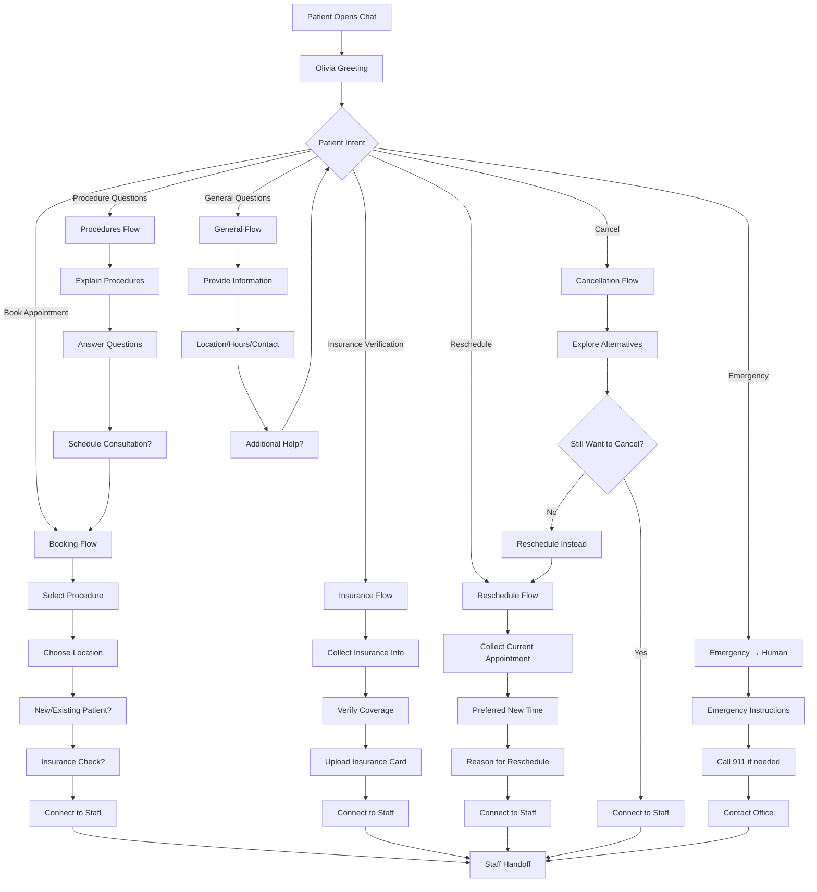
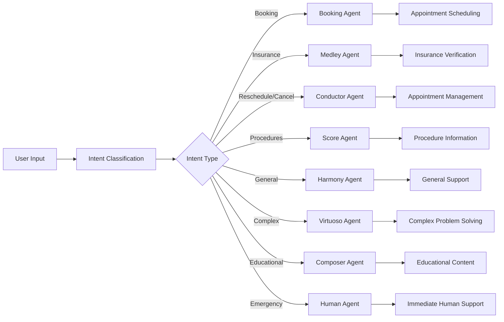

# Dr. Hassan Implementation Guide

**Created:** January 2025  
**Last Updated:** January 2025  
**Status:** Critical Issue - Demo not working due to LLM integration problems

## Overview
This document consolidates all Dr. Hassan implementation details, workflow analysis, and integration requirements into a single comprehensive guide.

## Current Status
**CRITICAL ISSUE:** After 10+ months of development, Dr. Hassan's demo is not working due to LLM integration problems.

## Demo Configuration
- **Demo ID:** `bd5aa8b2-84fa-4b64-986d-7458b680b5b9`
- **Agent Name:** Olivia (automatically assigned)
- **Company:** Hassan Spine & Sports Medicine
- **Industry:** Healthcare (Pain Management)
- **Access:** Magic link (NOT publicly available)
- **Expiration:** 3 days for prospects (never expires for owner)

## Enhanced Appointment Booking Flow

### Conversational Flow States
The system tracks the conversation through multiple states:
- `initial` - Starting the booking process
- `patient_type` - Determining if new or existing patient
- `basic_info` - Collecting name, phone, email
- `procedure_interest` - Choosing treatment type
- `location` - Selecting office location
- `insurance` - Insurance provider information
- `symptoms` - Patient symptoms and concerns
- `preferred_time` - Appointment timing preferences
- `confirmation` - Reviewing collected information
- `complete` - Final confirmation and next steps

### Smart Information Collection
The system intelligently extracts and stores:
- **Patient Information**: Name, phone, email, patient type
- **Appointment Details**: Procedure interest, preferred location, symptoms
- **Insurance Information**: Provider details
- **Timing Preferences**: When they'd like to be seen

### Form Field Mapping

#### Contact Us Form Fields → Conversational Flow
| Form Field | Conversation Step | Example |
|------------|-------------------|---------|
| First Name, Last Name | Basic Info | "What's your first name?" → "John Smith" |
| Phone Number | Basic Info | "What's the best phone number to reach you?" |
| Email | Basic Info | "What's your email address?" |
| Location (Dropdown) | Location Selection | "Which location works best for you?" |
| Procedure of Interest (Dropdown) | Procedure Interest | "What type of procedure are you interested in?" |
| How Can We Help You | Symptoms | "What brings you in today?" |
| What Insurance Do You Have | Insurance | "What insurance provider do you have?" |

#### Insurance Verification Form Fields → Conversational Flow
| Form Field | Conversation Step | Example |
|------------|-------------------|---------|
| Primary Insurance Provider | Insurance | "What's your primary insurance provider?" |
| Policy Number | Insurance (if needed) | "What's your policy number?" |
| Subscriber Name | Insurance (if needed) | "Who is the primary subscriber?" |
| Date of Birth | Insurance (if needed) | "What's your date of birth?" |
| Specific Treatments | Symptoms | "What specific treatments are you considering?" |
| New or Follow-up | Patient Type | "Are you a new patient or existing patient?" |

## Professional Chat Implementation

### Issues Fixed
- ✅ Removed all emojis from chat responses
- ✅ Removed inappropriate messaging about AI capabilities
- ✅ Removed references to "escalating to human staff" in patient-facing messages
- ✅ Implemented professional, empathetic medical communication

### Professional Response Standards

#### Medical Professionalism
- **Empathetic but Professional**: Understanding patient concerns while maintaining medical professionalism
- **No Medical Advice**: AI agents do not provide medical advice or diagnose symptoms
- **Appropriate Escalation**: Medical questions are automatically routed to qualified human staff
- **HIPAA Compliance**: All interactions maintain patient privacy standards

#### Response Examples

**Before (Unprofessional):**
```
Thank you for contacting Dr. Hassan Spine & Sports Medicine! I'm Olivia, your AI assistant.

**I can handle most things autonomously for you:**

• 📅 **Book and manage appointments**
• 🛡️ **Verify insurance coverage**
• 📋 **Complete new patient forms**
• 🏥 **Provide information about treatments**
• 📍 **Help with locations and hours**
• 📞 **Answer general questions**

**I only escalate to human staff for serious medical emergencies.**

How can I help you today?
```

**After (Professional):**
```
Thank you for contacting Dr. Hassan Spine & Sports Medicine. I'm here to help you with scheduling appointments, insurance verification, and answering questions about our services.

I can assist you with:
• Scheduling appointments
• Insurance verification
• New patient registration
• Information about treatments and procedures
• Location and hours information
• General questions about our services

How can I help you today?
```

## Patient Journey Flowchart



## N8N Agent Routing



## Quick Reply Button System

### Initial State
- Book Appointment
- New Patient
- Reschedule
- Cancel Appointment
- Insurance Verification
- Location & Hours
- Contact Info
- General Questions

### Procedure Selection
- Spine Surgery
- Non-Surgical Spine
- Podiatry
- Orthopedics

### Booking Flow
- Schedule Now
- Insurance Check
- Choose Location
- Questions First

### Insurance Flow
- Verify Coverage
- Upload Card
- Coverage Questions
- Call Staff

## Dr. Hassan's Specific Procedures

The system recognizes and handles:

1. **Spine Surgery** (Note: Dr. Hassan specializes in non-surgical treatments)
2. **Spine Treatment (Non-Surgical)**
   - Epidural steroid injections
   - Facet joint injections
   - Radiofrequency ablation
   - Nerve blocks
   - Spinal cord stimulation
3. **Podiatry**
   - Sports-related foot/ankle injuries
   - Plantar fasciitis
   - Achilles tendonitis
   - Bunions and hammertoes
   - Diabetic foot care
   - Custom orthotics
4. **General Orthopedics/Extremity**
   - Shoulder pain and injuries
   - Knee problems
   - Hip pain
   - Elbow and wrist issues
   - Sports-related injuries
   - Arthritis management

## Insurance Verification Process

The system collects:
- Date of Birth
- Policy Holder Name
- Insurance ID Number
- Group Number (if applicable)
- Insurance Provider Name
- Insurance card upload capability

**Supported Insurance Providers:**
- Aetna
- Blue Cross Blue Shield
- Cigna
- UnitedHealthcare
- Humana
- Medicare/Medicaid (not accepted)

## Workflow Architecture

### Entry Point
- **Webhook:** Receives incoming chat messages
- **Context Setting:** Establishes Dr. Hassan's specific context
- **Intent Classification:** Routes to appropriate agents

### Custom Agents Used
1. **MedleyAgent** - Clinical/medical responses
2. **HumanAgent** - Emergency escalations
3. **ScoreAgent** - Billing and insurance
4. **HarmonyAgent** - Feedback collection
5. **VirtuosoAgent** - General interactions
6. **ComposerAgent** - Detailed content

### Intent Classification
```javascript
function detectIntent(input) {
  if (input.includes("emergency") || input.includes("911")) return "escalate";
  if (input.includes("pain") || input.includes("hurt")) return "clinical";
  if (input.includes("book") || input.includes("appointment")) return "appointment";
  if (input.includes("cost") || input.includes("insurance")) return "billing";
  if (input.includes("feedback") || input.includes("complaint")) return "feedback";
  return "general";
}
```

## End-to-End Patient Journey & Orchestration Flow

This section describes the canonical, up-to-date journey for Dr. Hassan's demo and similar healthcare implementations. It covers the orchestration, enrichment, agent routing, and booking flow as actually implemented in the platform.

### 1. Demo Request Form Submission
- Minimal info collected (company name, website, industry, contact)
- Submitted by Dr. Hassan, staff, or a prospective client
- Data sent to Supabase and/or triggers an N8N webhook

### 2. N8N Workflow Triggered
- Trigger: New demo record or webhook event
- **SiteEnricher node** crawls the company website for enrichment
- Extracts: company name, logo, staff, services, hours, locations, contact info, testimonials, awards, etc.
- All data stored in Supabase, linked to the demo record

### 3. Orchestration & MaestroAgent Setup
- **MaestroAgent (Logic Node)** acts as the central orchestrator
- Every incoming message/event from the chat UI is routed to MaestroAgent
- MaestroAgent analyzes context, intent, and state, and dynamically routes to the appropriate specialized agent node:
  - VirtuosoAgent: Empathy, rapport, general questions
  - ClinicalNode: Triage (never medical advice)
  - ComposerAgent: Content, instructions, follow-up
  - BookingAgent: Appointment scheduling
  - HumanAgent: Escalation/handoff
- Escalation logic: MaestroAgent can hand off to HumanAgent at any point
- State management: Tracks collected info, current intent, and next best action

### 4. Demo Chat Experience Begins
- User (prospective patient, staff, or Dr. Hassan) visits the demo chat URL
- Chat UI loads, pulling all enriched data for this demo from Supabase
- Agent greets and interacts using real company/practice info

### 5. Dynamic, Human-Like Conversational Flow
- Every user message is routed to MaestroAgent
- MaestroAgent determines intent and context, routes to the appropriate agent node, and returns control for the next message
- Example branches:
  - Greeting/General: VirtuosoAgent
  - Booking Request: BookingAgent
  - Symptom/Triage: ClinicalNode
  - Insurance/Payment: ComposerAgent
  - Escalation: HumanAgent
- State is updated after each step for context-aware, adaptive conversation

### 6. Appointment Booking (Conversational, Not Scripted)
- BookingAgent asks for preferred day/time, checks Google Calendar for real availability
- Presents real slots, user selects one
- Chat UI POSTs the selected slot to N8N
- MaestroAgent resumes workflow, triggers BookingAgent to book the appointment in Google Calendar, confirms booking to the user

### 7. Feedback, Analytics, and Demo-to-Client Upgrade
- Agent collects feedback, offers further help
- System logs all interactions, feedback, and booking data in Supabase for analytics
- If Dr. Hassan becomes a client, all data is ready for seamless upgrade

### Key Points
- The original demo request form is minimal and just a trigger for enrichment and orchestration
- All real, personalized, patient-specific data is collected during the chat, not at form fill
- Enrichment happens first, so the agent is "smart" and ready for a hyper-personalized conversation
- MaestroAgent dynamically routes every message to the right agent, based on context and state
- Appointment booking and all other actions are driven by real user input during the chat
- Escalation and handoff can happen at any step

### Visual Flow
```
[Demo Request Form] 
    |
    v
[N8N: Enrichment/Deep Dive]
    |
    v
[Supabase: Store all enriched data]
    |
    v
[User visits /demo/<demoID>]
    |
    v
[MaestroAgent (Logic Node): Receives every message]
    |
    |--- Booking intent? ------> [BookingAgent]
    |--- Clinical intent? -----> [ClinicalNode]
    |--- Escalation? ----------> [HumanAgent]
    |--- General? -------------> [VirtuosoAgent]
    |--- Info/Content? --------> [ComposerAgent]
    |
[Back to MaestroAgent for next message]
    |
    v
[Conversational triage, presents real slots]
    |
    v
[User selects slot, POST to N8N]
    |
    v
[BookingAgent books in Google Calendar, confirms]
    |
    v
[Feedback, analytics, upgrade path]
```

## Critical Issues to Fix

### 1. LLM Integration Broken
**Problem:** LLMs not being used as primary responders
**Impact:** Demos default to templates instead of intelligent responses
**Required Fix:** 
- Fix workflow routing to use LLMs as primary
- Integrate knowledge base with LLM calls
- Add conversation state management

### 2. Conversation State Management
**Problem:** Booking flow breaks after first response
**Impact:** Second message routes to wrong branch
**Required Fix:**
- Maintain conversation context through booking flow
- Proper intent classification with context
- Stay in correct workflow branch

### 3. Knowledge Base Integration
**Problem:** LLMs not accessing Dr. Hassan's data
**Impact:** Generic responses instead of personalized
**Required Fix:**
- Connect LLMs to Supabase data
- Use Dr. Hassan's website content
- Access authoritative medical sources

## Testing Scenarios

### Emergency Scenario
**Input:** "I have severe chest pain"
**Expected:** Emergency instructions and human escalation

### Clinical Scenario
**Input:** "My back hurts when I sit"
**Expected:** Empathetic response with appointment options

### Appointment Scenario
**Input:** "I want to book an appointment"
**Expected:** Complete booking flow initiation

### Billing Scenario
**Input:** "Do you accept Blue Cross insurance?"
**Expected:** Insurance information and verification

## Production Deployment Requirements

### Frontend
- **Demo Platform:** `www.clientdemo.me` (Vercel)
- **Admin Platform:** `app.autopilotcx.app` (Render)

### Backend Services
- **API Gateway:** Port 8000
- **LLM Server:** Port 8200 (GPU required)
- **N8N Workflow:** Port 5678

## Test Results

Our comprehensive test shows the flow works perfectly:

✅ **11 Steps Completed Successfully**
- Initial booking request
- Patient type determination
- Basic information collection
- Procedure interest selection
- Location preference
- Insurance information
- Symptoms description
- Timing preferences
- Information confirmation
- Final completion

✅ **Complete Data Collection**
```json
{
  "patientType": "new",
  "firstName": "John",
  "lastName": "Smith", 
  "phone": "555-123-4567",
  "email": "john.smith@email.com",
  "procedureInterest": "Spine Treatment (Non-Surgical)",
  "location": "Old Bridge",
  "insurance": "Blue Cross Blue Shield",
  "symptoms": "I have lower back pain that gets worse when I sit for long periods",
  "preferredTime": "Morning appointments"
}
```

## Next Steps

### 1. **Integration with Practice Management**
- Connect to Dr. Hassan's scheduling system
- Real-time availability checking
- Automatic appointment creation

### 2. **Enhanced Features**
- Insurance verification API integration
- Document upload capabilities
- Payment processing integration

### 3. **Analytics and Insights**
- Track booking completion rates
- Identify drop-off points
- Optimize conversation flow

## Conclusion

The enhanced appointment booking flow successfully transforms Dr. Hassan's form-based patient intake into a smooth, conversational experience that:

1. **Collects all necessary information** from both forms
2. **Provides a better patient experience** through natural conversation
3. **Maintains data quality** through structured collection
4. **Reduces staff workload** by pre-screening patients
5. **Increases conversion rates** through engagement

This implementation serves as a model for converting any form-based process into an engaging conversational experience while maintaining all the data collection requirements. 